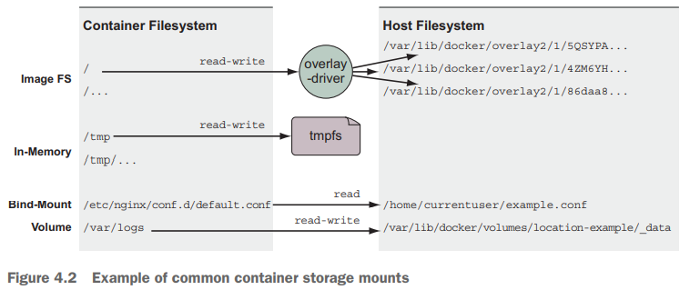

% Docker in Action: Second Edition
% Chapter 04
% Working with storage and volumes

# Working with storage and volumes

## Text Book

{height=350px}

## Chapter 04 - Objectives

- Demonstrate mount points
- Demonstrate how to share data between the host and a container
- Demonstrate how to share data between containers
- Explain the concept of using temporary, in-memory filesystems
- Explain how to managing data with volumes
- Discuss advanced storage with volume plugins

## Concept Review

- From chapter 01:
  - What are the two Linux concepts/features that make up a Linux Container?
  - Docker was created in what year/month?
  - Is the focus of Docker containers infrastructure or application deployment?
  - What is a Docker Container image?
  - What is a Docker Container instance?
  - What is the difference between a Linux Container and a Virtual Machine?

## Concept Review 2

- What is `--detached` mode?
- What is a CID?
- What does it mean to link two containers?

## Concept Review 3

- What are the three methods for obtaining Docker Images?
- What is a registry?
- Is a Docker Image a file?
- What is a layer?
- What is a major advantage of filesystem layers in Docker?
- How does the use of namespaces and `chroot` allow for filesystems to work in Docker?

## Introduction

- So far we have run a bunch of containers
  - They have been trivial applications
- What if we want to run a real application?
- What if we had a database?
  - Where would that file be stored?
  - Is it in a file inside the container?
  - What happens to that data when you stop the container or remove the container?
  - Where would you write log files so that they will outlive the container?
  - How would you get access to those logs to troubleshoot a problem?
  - How can other programs such as log digest tools get access to those files?

## File trees and mount points - 4.1

- Storage devices such as disk partitions or USB disk partitions are attached to specific locations in that tree
- Those locations are called **mount points**
- A mount point defines the location in the tree
  - The access properties to the data at that point (for example, writability)
  - The source of the data mounted at that point (for example, a specific hard disk, USB device, or memory-backed virtual disk)

## Mounts

- Mount points allow software and users to use the file tree in a Linux environment
  - Without knowing exactly how that tree is mapped into specific storage devices
- Logic follows that if different storage devices can be mounted at various points in a file tree, we can mount nonimage-related storage at other points in a container file tree
- That is exactly how containers get access to storage on the host filesystem and share storage between containers
- The best place to start is by understanding the three most common types of storage mounted into containers:
  - Bind mounts
  - In-memory storage
  - Docker volumes

## Storage Types

- These storage types can be used in many ways...
  - Figure 4.2 shows an example of a container filesystem
  - That starts with the files from the image
  - Adds an in-memory tmpfs at `/tmp`
  - bind-mounts a configuration file from the host
  - writes logs into a Docker volume on the host

## Bind mounts - 4.2

- Bind mounts are mount points used to remount parts of a filesystem tree onto other locations
  - Suppose you’re running a web server that depends on sensitive configuration on the host and emits access logs that need to be forwarded by your log-shipping system
  - You could use Docker to launch the web server in a container
  - Then bind-mount the configuration location as well as the location where you want the web server to write log
  - In Figure 4.3, lets deploy a web server container
  - Let us deploy an log forwarder software container (theoretical)
  - Let us demonstrate how mounts work and how we can share a single file between two containers
  
## Figure 4.3

## Mount and Bind Options

- Lets look at printed page 65, 66, and 67
  - The main thing to capture here is that we are going to mount files from our local filesystem into the Docker Container
  - Then we will set those conf files as read-only (for security)
  - We will also enable the container to write a log file back to our local filesystem from the container
  - But bind mounts are not optimal for general computing (say hosting a database file)

## In-memory storage - 4.3

- 

## Summary - Part 1 of 2

- If not complete demonstrate the Wordpress 3 container MySQL 1 container node install project

## Summary - Part 2 of 2

- If not complete demonstrate the Wordpress 3 container MySQL 1 container node install project

## Deliverable

- If not complete demonstrate the Wordpress 3 container MySQL 1 container node install project
  
## Questions

Any questions?
